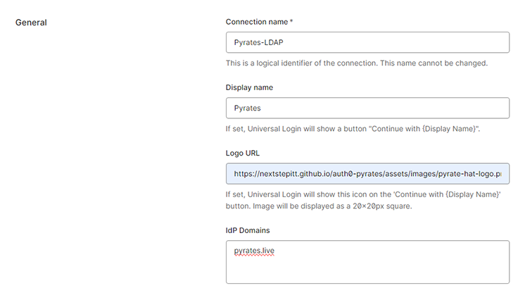

[//]: # (README.md)
[//]: # (Copyright © 2024 Joel A Mussman. All rights reserved.)
[//]: #


# Auth0 LDAP Enterprise Connection Example

I have been asked many times in Auth0 training classes about setting up an enterprise connection.
The free developer tenant at Auth0 allows configuration of the Enterpise connections for 22 days.
Below  are the instructions for a demonstration that I work with using the free tenant.
You may register for a free developer tenant by clicking the "*Sign up*" button at https://developer.auth0.com.

Some setup is required.
You can use your own LDAP server, an Okta organization (tennt) with the LDAP server enabled,
or just use the server I have set up and is publically available at ldaps://dev-43633848.oktapreview.com.
The actual Okta organization URI must be used for LDAP, not a custom domain, which is
why the random organiztion name in this URI (itself a free Okta developer tenant).
This LDAP server is secure: none of the users defined below for authentication can
log into the tenant itself, they cannot reach the Okta user dashboard, and their passwords
cannot be changed through LDAP.

## The Auth0 AD/LDAP Connector

The [Auth0 AD/LDAP Connector](https://auth0.com/docs/authenticate/identity-providers/enterprise-identity-providers/active-directory-ldap/ad-ldap-connector)
is the agent used to link the LDAP server to your Auth0 tenant.
This is a publically available application that needs to run on your own infrastructure.
Auth0 does not call the agent, the agent phones home to the API at your Auth0 tenant using HTTPS.
That eliminates any security risk.
Since the agent is not a callable endpoint in your enterprise it cannot
be attacked by trying to connect to it, and it will only call the API you configured.
The agent implements the adapter pattern: it translates from LDAP to what the Auth0 API requires.

The agent was written for the Active Directory version of LDAP, and you will have to do
some reconfiguration to communicate with other LDAP servers.
For example, Active Directory uses the attribute names "person", "group", and "member" while many
LDAP servers use "inetOrgPerson", "groupOfUniqueNames", and "uniqueMember" for the same purpose.

Here is the [schema](https://auth0.com/docs/authenticate/identity-providers/enterprise-identity-providers/active-directory-ldap/ad-ldap-connector/ad-ldap-connector-config-file-schema)
for the configuration file.
You will most likely have to redefine some of these configuration attributes in the
config.json startup file for the agent: LDAP_BASE, LDAP_BASE_GROUPS, LDAP_URL, LDAP_BIND_USER, LDAP_USER_BY_NAME,
LDAP_SEARCH_QUERY, LDAP_SEARCH_ALL_QUERY, LDAP_SEARCH_GROUPS, and GROUPS.

### Warning: Group Membership Retrieval

As of August 21, 2024 the Auth0 AD-LDAP agent still has an issue retrieving groups fron non-AD servers.
Active Directory includes the groups in the intial data sent for the user and the agent uses this.
Many LDAP servers, Okta included, do not do this.
Setting the GROUPS attribute to *true* will cause the agent to make a secondary request for the
group information as expected, but the logic is flawed and the agent will crash.
Follow pull request 254 to see if this has been resolved: https://github.com/auth0/ad-ldap-connector/pull/254.
Until this is resolved, make sure *"GROUPS": false* is set in the configuration for servers that require
the second step to retrieve groups, or the agent will crash.

## Configure an OKTA LDAP Server (optional)

If you want to configure your own Okta organization as an LDAP server, Okta supports that.
To get a free Okta developer tenant visit https://developer.okta.com, close the splash page if one appears,
click the "*Sign up*" button, and choose "*Sign up free for Developer Edition*".

I always set this up before the demonstration, in fact
I use the configuration I leave permanently and publicly availabe at ldaps://dev-43633848.oktapreview.com
which you could use too.

These steps assume some familarity with administrating and Okta organization.

1. In your Okta admin console go to Directories &rarr; Directory Integrations and choose the LDAP server integration.
The configuration should look similar to this, your domain will be different.
Notice that nothing may be changed except for the groups served.
App groups are the imported groups from other external directory integrations and I don't care to pass them through:

    

1. Go to Directories &rarr; People and create a new user *LDAP BIND*.
Assign the password "piratesrulethecaribbean".
This user will be used with the calls the LDAP endpoint to perform authentications, and only a password works with LDAP.

1. Go to Directories &rarr; Groups and create a new group *LDAP Read-Only*.
Assign the *LDAP BIND* user to the *LDAP Read-Only* group.

1. Go to Security &rarr; Administrators.
Assign read-only administrator privileges to the *LDAP Read-Only* group.
The bind user needs to be able to read the users and groups in the directory.

1. Go back to Directories &rarr; Groups and create another group *LDAP Users*.
Add any users intended for demonstrating the enterprise connection to this group.
I like to use pirates from this list:

    |Username|Password|Name|
    |---|---|---|
    |anne.bonny@pyrates.live|P!rates17|Anne Bonny|
    |blackbeard@pyrates.live|P!rates17|Edward Teach|
    |blacksam@pyrates.live|P!rates17|Sam Belamy|
    |calicojack@pyrates.live|P!rates17|Jack Rackham|
    |mary.read@pyrates.live|P!rates17|Mary Read|

1. Go to Security &rarr; Authenticators.
Edit the Password authenticator.
Add a Password Policy at the top of the list of Password Policies named *Deny LDAP Users*:
    1. Link the policy to both the *LDAP Read-Only* and *LDAP Users* group.
    1. Select LDAP as the authenticator.
    1. Choose whatever you would like for the password complexity, that is not important for us.
    1. Disable *Enforce password history* and the *Minimum password age* so the passwords last forever.
    1. Enable *Lock out* and *The account is automatically unlocked* (Soft Lock) to stop brute force attacks and reset an account after a cooling off period.

1. Add a single rule to the policy for all users anywhere that denys changing passwords.
This is all to block passwords from being changed through LDAP if you are publishing those passwords for test accounts (as I am).

1. Go to Security &rarr; Global Session Policy and configure a policy for the groups *LDAP Read-Only* and *LDAP Users*:
    1. Make sure this policy is *first* in the list!
    1. Add a single rule that if if the user authenticates via the LDAP interface a password is required and MFA is not required (no MFA for the demonstration).

    When the administrator account used to authenticate users calls the LDAP server only the GS policy is used (no application) and you certainly do not want MFA.
    With only one rule, if it is not LDAP the administrator will fall through to find the next matching policy.
    Yes, global session policies will fall through if there is no matching rule, and this is one scenario where we really need that feature!

    The GS policy for dev-43633848.oktapreview.com looks like this:

    

1. Go to Security &rarr; Authentication Policies.
Locate and open the policy for the *Okta Admin Console*.

1. Add a new rule named *Deny LDAP Read-Only*.
Apply the rule only to the LDAP Read-Only group, and deny access to the admin console.
This will block the bind user from entering the organization admin website.
MFA should be kicking in for all admin users anysays, as a second layer of security:

    

1. Open the authentication policy for the *Okta Dashboard*.
This is to prevent the bind and test users from accessing the dashboard and attempting to
change their passwords.

1. Add a new rule named *Deny LDAP Read-Only and LDAP Users.
    1. Deny access to the end-user dashboard.
    1. Make sure it is the first rule.

    

1. Return to the LDAP settings (Directories &rarr; Directory Integrations; select *LDAP Interface*).
Put together the configuration changes for the Auth0 AD/LDAP connector from LDAP attributes exposed by Okta.
This is the configuration from ldaps://dev-43633848.oktapreview.com, change the base DN for your own server:

    ```
    "LDAP_BASE": "dc=dev-43633848, dc=oktapreview, dc=com",
    "LDAP_BASE_GROUPS": "ou=groups, dc=dev-43633848, dc=oktapreview, dc=com",
    "LDAP_URL": "ldaps://dev-43633848.ldap.oktapreview.com",
    "LDAP_BIND_USER": "uid=ldap.bind@pyrates.live, ou=users, dc=dev-43633848, dc=oktapreview, dc=com",
    "LDAP_USER_BY_NAME": "(uid={0})",
    "LDAP_SEARCH_QUERY": "(&(objectClass=inetOrgPerson)(cn={0}))",
    "LDAP_SEARCH_ALL_QUERY": "(objectClass=inetOrgPerson)",
    "LDAP_SEARCH_GROUPS": "(&(objectClass=groupOfUniqueNames)(uniqueMember={0}))",
    "GROUPS": true,
    ```

Note that Okta LDAP uses the "uid" attribute for the username, not "cn", which is not standard.
Also, Okta LDAP uses the more popular "inetOrgPerson", "groupOfUniqueNames", and "uniqueMember" attributes in place of the "person", "group", and "member" attributes served
by Active Directory.

These JSON entries for the public server at ldaps://dev-43633848.ldap.oktapreview.com are also saved
in the repository project file [ad-ldap-configuration.json](file://./ad-ldap-configuration.json).

## Configure the Auth0 Enterprise Connection (and the AD/LDAP connector)

These instructions connect to the public LDAP server hosted at ldaps://dev-43633848.oktapreview.com.
Change the URI, user, password, and other configuration settings to match your LDAP server.

This server is locked down; you can authenticate against it but do nothing else.
The users for proving authentcation do not have access to the Okta user dashboard,
and neither does the LDAP administrator account.
If you want to use your own Okta organization as an LDAP server, change the email domain name,
the Okta URI, and the base DN.

1. In the Auth0 tenant go to Authentication &rarr; Enterprise.
Add the enterprise connector for LDAP.
If you want to connect to the public example LDAP server, use the IdP domain "pyrates.live":

    

1. Click the *Create* button.

1. Make a note of the provisioning ticket from the Setup tab.
You can always come back and get it on this tab.
This ticket/token is unique to your Auth0 tenant, not the LDAP server.
This is the credential for the Auth0 AD-LDAP connector (the agent) to authenticate with the Auth0 API:

    

1. Look just above the provisioning ticket are the links for the agent.
Ignore the *Install for Windows* button, even if you plan on running the agent on Windows.
It is not inuitively obvious, but click the *Install for Mac/Linux* link and the first instructions on that
page are how to install for Windows!

    

1. Pick the appropriate section below for configuration changes to the basic installation.
Read the dependency requirements at the top of the Auth0 instructions!
Note: this lines up against the instructions as of 8/21/2024:

### Install the connector for Windows

Notes to the instruction steps:

1. *Run the Installer*: follow as defined.

2. *Link to Auth0* follow as defined.

4. *Link to LDAP*:
    1. These atribute values below are for ldaps://dev-43633848.oktapreview.com; substitute your own for your sever.
    1. The Username attribute is the fully qualified DN for the user in LDAP, not just their username.
    1. In the case of Okta LDAP, the uid in the Username attribute is the common username of the user that will call LDAP.
    1. The password "piratesrulethecaribbean" is the actual password for the LDAP user on the public LDAP server.
    ```
    Base DN: dc=dev-43633848, dc=oktapreview, dc=com
    LDAP Connection String: ldaps://dev-43633848.ldap.oktapreview.com
    Username: uid=ldap.bind@pyrates.live, ou=users, dc=dev-43633848, dc=oktapreview, dc=com
    Password: piratesrulethecaribbean
    ```

5. *Post installation instructions (Auth0 provided the minimum, we need more):*
    1. Edit the config.json file at C:\Program Files (x86)\Auth0\AD LDAP Connector\config.json
    1. Notice the LDAP_BIND_PASSWORD has been replaced with LDAP_BIND_CREDENTIALS containing a token.
    1. Add the remaining attributes to the configuration:
    ```
    "LDAP_BASE_GROUPS": "ou=groups, dc=dev-43633848, dc=oktapreview, dc=com",
    "LDAP_USER_BY_NAME": "(uid={0})",
    "LDAP_SEARCH_QUERY": "(&(objectClass=inetOrgPerson)(cn={0}))",
    "LDAP_SEARCH_ALL_QUERY": "(objectClass=inetOrgPerson)",
    "LDAP_SEARCH_GROUPS": "(&(objectClass=groupOfUniqueNames)(uniqueMember={0}))",
    "GROUPS": false,
    ```
    1. Verify the value of "GROUPS" is false, or the agent may crash.
    1. Restart the Windows *Auth0 ADLDAP* service.

### Install the connector for other platforms

Notes to the instruction steps:

1. *Step 1*: follow as defined.

2. *Step 2*: follow as defined.

3. *Step 3*: follow as defined.

4. *Step 4*: There are additional configuration changes that have to be made if your server is not Active Directory:
    1. These values are for ldaps://dev-43633848.oktapreview.com, substitute your own for your sever.
    1. The attribute changes are to redefine the LDAP attribute names from the AD names it expects; this will vary
from LDAP server to server, see the conversation in the [Auth0 AD/LDAP Connector](#The-Auth0-AD/LDAP-Connector)
section above.
    1. In the case of Okta LDAP, the uid in the LDAP_BIND_USER attribute is the common username of the user.
    1. Note the addition of LDAP_BIND_PASSWORD.
    ```
    "LDAP_BASE": "dc=dev-43633848, dc=oktapreview, dc=com",
    "LDAP_BASE_GROUPS": "ou=groups, dc=dev-43633848, dc=oktapreview, dc=com",
    "LDAP_URL": "ldaps://dev-43633848.ldap.oktapreview.com",
    "LDAP_BIND_USER": "uid=ldap.bind@pyrates.live, ou=users, dc=dev-43633848, dc=oktapreview, dc=com",
    "LDAP_BIND_PASSWORD": "piratesrulethecaribbean",
    "LDAP_USER_BY_NAME": "(uid={0})",
    "LDAP_SEARCH_QUERY": "(&(objectClass=inetOrgPerson)(cn={0}))",
    "LDAP_SEARCH_ALL_QUERY": "(objectClass=inetOrgPerson)",
    "LDAP_SEARCH_GROUPS": "(&(objectClass=groupOfUniqueNames)(uniqueMember={0}))",
    "GROUPS": false,
    ```
    1. Verify the value of "GROUPS" is false, or the agent may crash.

1. *Step 5*: follow as defined.

1. *Step 6*: follow as defined.

1. *Step 7*: follow as defined.

### Followup for all platforms to verify the enterprise connection

1. On the Auth0 tenant enterprise connection settings page for LDAP verify that the connector is green/online:

    

    If it isn't, check both the logs on the Auth0 tenant and for the agent, *logs.log* in the agent installation folder.
    The agent will only be green if it can connect to both LDAP and Auth0.
    A common error is "LDAP 49", the credentials for the LDAP server are bad.

1. Make sure the enterprise connection is enabled for the appropriate applications;
this may be the whole point of the enterprise connection, the partner users are the only ones authorized for particular applications.

1. Verify that a user from the LDAP server may authenticate and reach the application.
If you connected to the public LDAP server at ldaps://dev-43633848.ldap.oktapreview.com, try some users from the following table:

    |Username|Password|Name|
    |---|---|---|
    |anne.bonny@pyrates.live|P!rates17|Anne Bonny|
    |blackbeard@pyrates.live|P!rates17|Edward Teach|
    |blacksam@pyrates.live|P!rates17|Sam Belamy|
    |calicojack@pyrates.live|P!rates17|Jack Rackham|
    |mary.read@pyrates.live|P!rates17|Mary Read|

1. Gotcha: The user's full name in the Auth0 tenant is not set into the "name" profile attribute, rather the user's email address is set.
This attribute is translated poorly from the source by the Auth0 AD/LDAP connector, even if the full name is present.
This is contradictory to the [profile schema](https://auth0.com/docs/manage-users/user-accounts/user-profiles/user-profile-structure)
defined by Auth0, but it is the choice of the agent.

1. Gotcha: try testing with Blackbeard and check the account created in Auth0.
You will find that blackbeard@pyrates.live does not appear in the profile, only the email address edward.teach@pyrates.live.
Edward feels that using his name for email reduces the SPAM he recieves.
However, using blackbeard@pyrates.live as the login name continues to work because the enterprise LDAP server sends the same user id and
that maps to the edward.teach@pyrates.live account on the Auth0 side.

### ldapsearch

1. To verify the public LDAP at daps://dev-43633848.ldap.okta.com: if ldapsearch is available on your system this command should return a list of all the users.
$ is the prompt and the code window scrolls horizontally:

    ```
    $ ldapsearch -H "ldaps://dev-43633848.ldap.okta.com" -b "ou=users,dc=dev-43633848,dc=okta,dc=com" -x -D "uid=ldap.bind@pyrates.live,ou=users,dc=dev-43633848,dc=okta,dc=com" -w "piratesrulethecaribbean" "(objectClass=inetOrgPerson)"
    ```
1. Here the search parameters are modified to return an inetOrgUser with a particular username.
LDAP uses a prefix operator notation, so the & for and preceeds the two operands:

    ```
   $ ldapsearch -H "ldaps://dev-43633848.ldap.okta.com" -b "ou=users,dc=dev-43633848,dc=okta,dc=com" -x -D "uid=ldap.bind@pyrates.live,ou=users,dc=dev-43633848,dc=okta,dc=com" -w 'piratesrulethecaribbean' "(&(objectClass=inetOrgPerson)(uid=calicojack@pyrates.live))"
    # extended LDIF
    #
    # LDAPv3
    # base <ou=users,dc=dev-43633848,dc=okta,dc=com> with scope subtree
    # filter: (&(objectClass=inetOrgPerson)(uid=calicojack@pyrates.live))
    # requesting: ALL
    #

    # calicojack@pyrates.live, users, dev-43633848.okta.com
    dn: uid=calicojack@pyrates.live,ou=users,dc=dev-43633848,dc=okta,dc=com
    objectClass: top
    objectClass: person
    objectClass: organizationalPerson
    objectClass: inetOrgPerson
    uid: calicojack@pyrates.live
    uniqueIdentifier: 00u4y1ov4grTCCmVd5d7
    organizationalStatus: ACTIVE
    givenName: Jack
    sn: Rackham
    cn: Jack Rackham
    mail: calicojack@pyrates.live
    nickName: Calico Jack

    # search result
    search: 2
    result: 0 Success

    # numResponses: 2
    # numEntries: 1
   $
    ```

## License

The use of this demonstration is licensed under the MIT license. You may use and modify all or part of it as you choose, as long as attribution to the source is provided per the license. See the details in the [license file](./LICENSE.md) or at the [Open Source Initiative](https://opensource.org/licenses/MIT).


<hr>
Copyright © 2024 Joel A Mussman. All rights reserved.